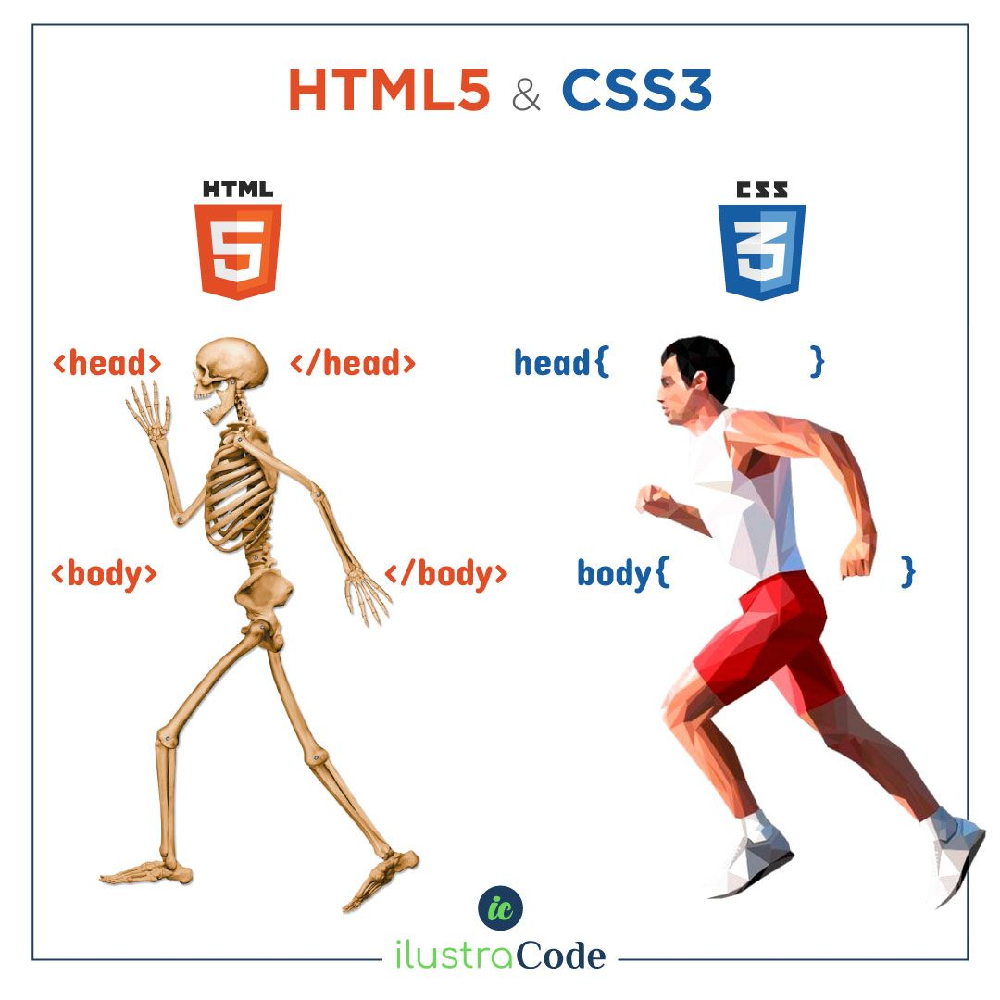

# Responsive Landing Page - HTML + CSS Challenge | CITi UFPE

<p align="center">

</p>

## Overview

This project represents the inaugural challenge faced during the trainee stage of the CITi UFPE development subarea. The objective was to replicate a responsive landing page using only HTML and CSS, showcasing the team's skills in front-end development.

Click [here](https://shellyda.github.io/responsive-landingpage-boutique/) to check out the deployed project!

## Project Structure

The project is organized with simplicity and clarity in mind, containing the following key components:

- **HTML Files:** The structural foundation of the landing page.
- **CSS Stylesheets:** Responsible for styling and ensuring a responsive design.
- **Images:** Supporting visuals for an enhanced user experience.

## Challenge Highlights

- **Responsive Design:** The landing page is crafted to seamlessly adapt to various screen sizes, ensuring an optimal viewing experience on both desktop and mobile devices.

- **HTML + CSS Mastery:** The project underscores the team's proficiency in HTML and CSS, as it exclusively utilizes these technologies to bring the landing page to life.

## How to Use

1. Clone the repository to your local machine.
   ```bash
   git clone https://shellyda.github.io/responsive-landingpage-boutique.git 
   ```
## Usage Instructions

1. Clone the repository:
   ```bash
   git clone https://shellyda.github.io/responsive-landingpage-boutique.git
   ```
2. Open the index.html file in your preferred web browser.
3. Explore the responsive landing page, appreciating the design achieved through HTML and CSS.

## Contributing
If you'd like to contribute to this project, please follow these steps:

1. Fork the repository.
2. Create a new branch for your feature or bug fix.
3. Make your changes and commit them.
4. Push to your fork and submit a pull request.
5. Feedback
   
Any feedback or suggestions are welcome. Feel free to open an issue or reach out to us with your thoughts.

## Credits
This challenge was brought to you by the CITi UFPE development subarea trainees.

Happy Coding! 🚀

---
<p align=center>
  
</p>
